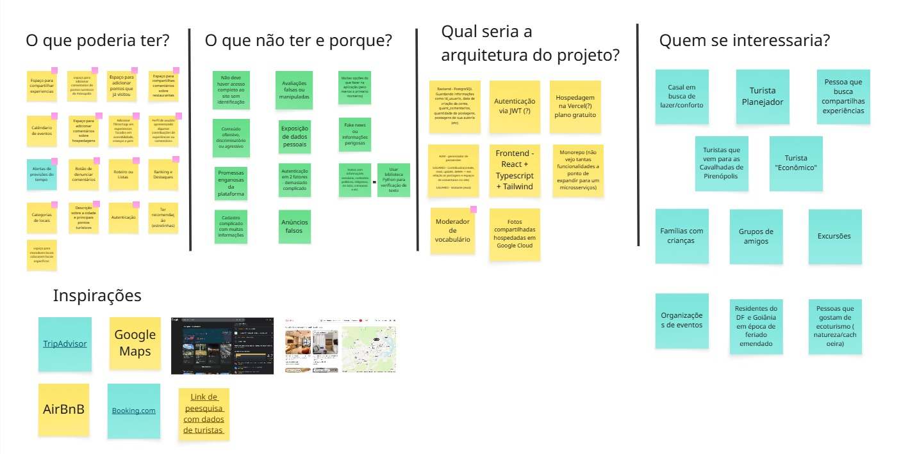
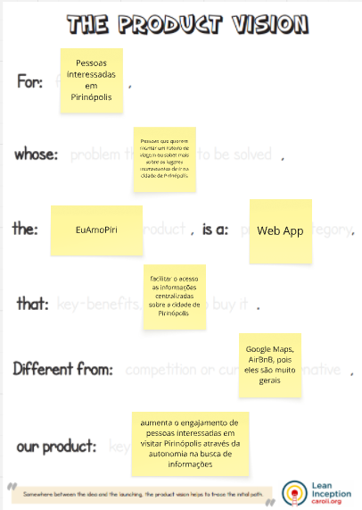
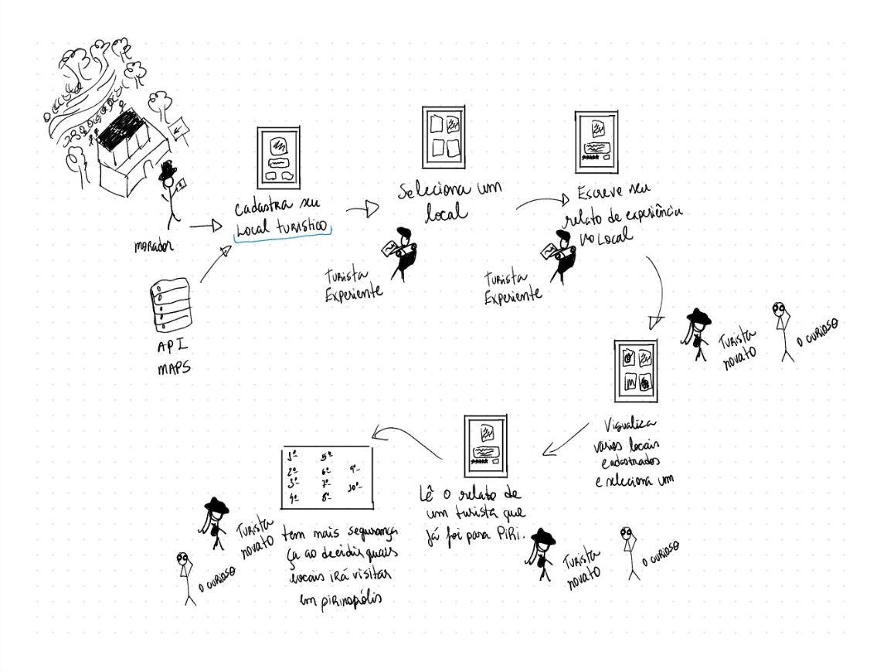

## 1.1.3 Decision

Na fase de *Decision*, a equipe define com mais clareza qual caminho o projeto vai seguir e o que será prototipado.

As soluções construídas nas etapas anteriores são analisadas em conjunto. A equipe revisita as propostas, discute os pontos mais relevantes e avalia o que faz mais sentido para o projeto.

A partir dessas discussões, o grupo busca chegar a um consenso, selecionando e combinando os melhores aspectos das ideias levantadas até convergir em uma única solução. Essa decisão final orienta as próximas etapas, trazendo mais foco e alinhamento para o desenvolvimento do projeto.

---

### Brainstorming

Para definir o direcionamento final do projeto, a equipe utilizou o Miro como ferramenta de apoio para organizar e revisar as ideias levantadas anteriormente.

*Figura 1 – Brainstorming Final. Fonte: elaboração da equipe.*

Nesse momento, todas as propostas foram analisadas em conjunto, permitindo que cada integrante contribuísse com sua visão, destacasse pontos importantes e questionasse o que não parecia tão relevante.

A partir dessas discussões, as ideias foram sendo filtradas até chegar em um conjunto mais claro e alinhado com os objetivos do projeto.

Esse resultado consolida a visão do projeto e serve como base para orientar as próximas etapas de desenvolvimento. 

<b>Participantes do Brainstorming:</b> 
<a href="https://github.com/Marianamrts" target="_blank">Mariana Martins</a>, 
<a href="https://github.com/milenamso" target="_blank">Milena Marques</a>, 
<a href="https://github.com/daviegito" target="_blank">Davi Egito</a>, 
<a href="https://github.com/leticiakrpaiva" target="_blank">Leticia Paiva</a>, 
<a href="https://github.com/annacbrandao" target="_blank">Anna Brandão</a>, 
<a href="https://github.com/Chaotzuu" target="_blank">João Victor</a>, 
<a href="https://github.com/Samuelvlobo" target="_blank">Samuel Lobo</a>, 
<a href="https://github.com/gabrieladouradof" target="_blank">Gabriela Dourado</a>, 
<a href="https://github.com/AmandaaMoura" target="_blank">Amanda de Moura</a>

### Product Vision

Como parte das decisões do projeto, a equipe também definiu a visão do produto, com o objetivo de alinhar o entendimento sobre o problema, o público-alvo e o valor que a solução pretende entregar.

*Figura 2 – Product Vision. Fonte: Lean Inception.*

A definição da Product Vision permitiu organizar de forma clara para quem o produto é direcionado, qual problema busca resolver, como se posiciona no mercado e quais são seus principais diferenciais. Esse alinhamento foi fundamental para garantir que todas as decisões tomadas pela equipe estivessem conectadas a um objetivo comum.

<b>Participantes do Product Vision:</b> 
<a href="https://github.com/Marianamrts" target="_blank">Mariana Martins</a>, 
<a href="https://github.com/milenamso" target="_blank">Milena Marques</a>, 
<a href="https://github.com/daviegito" target="_blank">Davi Egito</a>, 
<a href="https://github.com/leticiakrpaiva" target="_blank">Leticia Paiva</a>, 
<a href="https://github.com/annacbrandao" target="_blank">Anna Brandão</a>, 
<a href="https://github.com/Chaotzuu" target="_blank">João Victor</a>, 
<a href="https://github.com/Samuelvlobo" target="_blank">Samuel Lobo</a>, 
<a href="https://github.com/gabrieladouradof" target="_blank">Gabriela Dourado</a>, 
<a href="https://github.com/AmandaaMoura" target="_blank">Amanda de Moura</a>

### Rich Picture

Durante o processo, cada integrante da equipe elaborou sua própria versão de *Rich Picture*, com diferentes formas de representar o funcionamento do sistema e a interação entre os usuários.

Após a análise conjunta dessas propostas, a equipe discutiu os pontos mais relevantes de cada uma e decidiu por uma versão final, que melhor representa a solução de forma clara e completa.

*Figura 3 – Rich Picture final do sistema. Fonte: elaboração da Amanda de Moura.*

O diagrama apresenta a visão consolidada do projeto, ilustrando o fluxo de interação entre moradores, turistas experientes, turistas novatos e curiosos. Também evidencia como os locais são cadastrados, como as experiências são compartilhadas e como essas informações são consumidas pelos usuários.

Dessa forma, o *Rich Picture* final sintetiza as ideias da equipe em uma única representação visual, servindo como base para o entendimento do sistema e para orientar as próximas etapas de desenvolvimento.

### Quadro no Miro

O quadro utilizado durante o processo de brainstorming e definição das decisões do projeto pode ser acessado neste link: [Miro – EuAmoPiri](https://miro.com/app/board/uXjVGq_wkH0=/?share_link_id=318304118342).

## Referências

GOOGLE. *Design Sprint Kit: Overview*. Disponível em: <https://designsprintkit.withgoogle.com/methodology/overview>. Acesso em: 04 abr. 2026.

SERRANO, Milene. *Aula sobre Design Sprint*. Universidade de Brasília. Disponível em: <https://unbbr-my.sharepoint.com/personal/mileneserrano_unb_br/_layouts/15/stream.aspx>. Acesso em: 04 abr. 2026.

## Histórico de Versão

| Versão | Data       | Descrição                                                                 | Autor(es)                      |
| :-:    | :-:        | :-                                                                        | :-                             |
| 1.0    | 04/09/2025 | Criação e descrição da página de Decision                                 | [Letícia Paiva][leticiakrpaiva] |

[leticiakrpaiva]: https://github.com/leticiakrpaiva